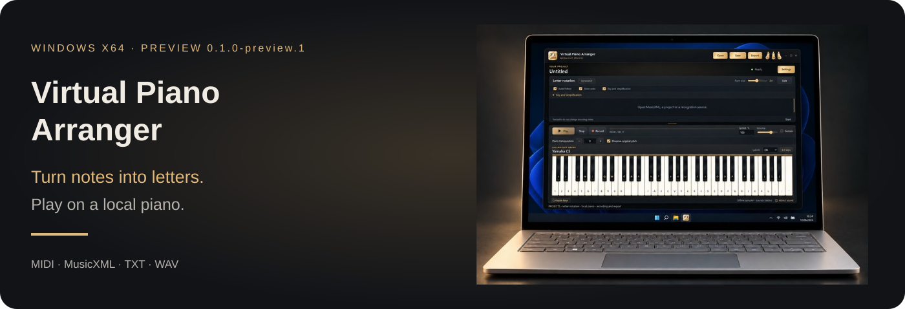

[Русский](docs/README.ru.md) · [Deutsch](docs/README.de.md) · [English](README.md)

*Illustrative laptop mockup; not a device compatibility test.*

**[Download](https://github.com/popovantondev/VirtualPianoArranger/releases/tag/v0.1.0-preview.1)** · **[User guide](https://popovantondev.github.io/VirtualPianoArranger/Guide-en.html)** · **[Report a problem](https://github.com/popovantondev/VirtualPianoArranger/issues/new)**

## Features

| MIDI · part selection | Letter notation |
|---|---|
| Piano sound and WAV | Key preview |

# Virtual Piano Arranger

An offline piano with letter notation, MIDI part selection and score adaptation for a 61-key computer keyboard.

An educational, non-commercial demonstration project for exploring music software and its capabilities. The author is not selling this application. This describes the project's purpose, not a restriction on rights granted by MIT or third-party licenses. It does not imply affiliation with or endorsement by component authors.

Windows x64 · English / Русский / Deutsch · 0.1.0-preview.1

[Download Windows portable](https://github.com/popovantondev/VirtualPianoArranger/releases/download/v0.1.0-preview.1/VirtualPianoArranger-0.1.0-preview.1-windows-x64-portable.zip) · [SHA-256](https://github.com/popovantondev/VirtualPianoArranger/releases/download/v0.1.0-preview.1/SHA256SUMS.txt) · [Corresponding sources](https://github.com/popovantondev/VirtualPianoArranger/releases/download/v0.1.0-preview.1/VirtualPianoArranger-0.1.0-preview.1-corresponding-sources.zip)

## First steps

Extract the entire portable folder and start `VirtualPianoArranger.exe`. Do not move the EXE away from its companion files. The portable package needs no Python installation or administrator access.

Open a MIDI file, audition parts and select the parts to import. MusicXML, VPA projects and letter TXT are also supported. PDF/image recognition requires the bundled recognition runtime and remains experimental: compare pitches and timing with the source.

Open **Key and simplification** above the letters. Preview transposition and chord fullness before applying. PC/balanced/musical presets reduce accompaniment using original notes. Single-note modes cannot reduce chords further. Original-pitch linking preserves the source sound; adapted letter registers may differ.

**Show rests** is available above the notation and in the key dialog. It displays real silence in the selected parts, not ordinary spacing or tiny MIDI articulation gaps. TXT has no timing; rests and automatic playback are not invented.

## Guides and limitations

[English guide](https://popovantondev.github.io/VirtualPianoArranger/Guide-en.html) · [Русское руководство](https://popovantondev.github.io/VirtualPianoArranger/Guide-ru.html) · [Deutsche Anleitung](https://popovantondev.github.io/VirtualPianoArranger/Guide-de.html)

MIDI parts currently sound as piano, not their original General MIDI instruments. Some files require explicit approximate-playback consent. WAV recording/export is local; other audio export formats need a separately available FFmpeg. Audio/video transcription and YouTube import are not available. Recognition accuracy, other PCs and long sessions still need review. The Windows EXE is unsigned.

The application's original code is licensed under [MIT](LICENSE). Third-party code, piano samples and model files retain their own licenses; MIT does not relicense those components.

Keep the complete portable folder, license texts and notices. The release includes a companion source archive and SHA-256 file; read [distribution notices](DISTRIBUTION_NOTICES.md), [model provenance](MODEL_PROVENANCE.md) and [library replacement instructions](LIBRARY_REPLACEMENT.md). This is a Preview, not an assertion that every score or Windows PC has been tested.
