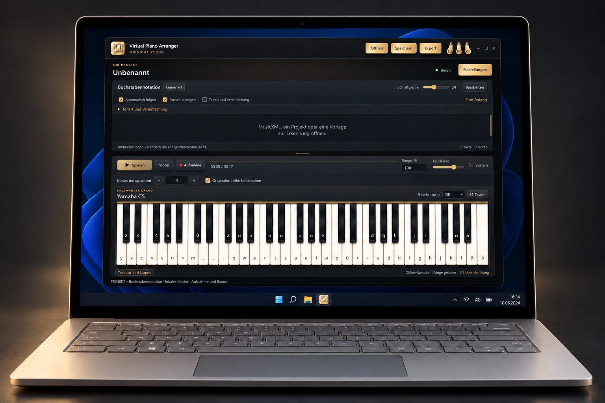

# Virtual Piano Arranger

[English](../README.md) · [Русский](README.ru.md) · [Deutsch](README.de.md)

Ein Offline-Klavier mit Buchstabennotation, MIDI-Stimmenauswahl und Notenanpassung für eine Computertastatur mit 61 Tasten.

Ein nichtkommerzielles Lern- und Demonstrationsprojekt zur Erkundung von Musiksoftware und ihren Möglichkeiten. Der Autor verkauft diese Anwendung nicht. Dies beschreibt den Projektzweck und beschränkt keine Rechte aus MIT oder den Lizenzen der Drittanbieterkomponenten. Eine Verbindung zu deren Autoren oder deren Zustimmung wird nicht behauptet.

Windows x64 · Deutsch / Русский / English · 0.1.0-preview.1

[Windows-Portable herunterladen](https://github.com/popovantondev/VirtualPianoArranger/releases/download/v0.1.0-preview.1/VirtualPianoArranger-0.1.0-preview.1-windows-x64-portable.zip) · [SHA-256](https://github.com/popovantondev/VirtualPianoArranger/releases/download/v0.1.0-preview.1/SHA256SUMS.txt) · [Zugehörige Quellen](https://github.com/popovantondev/VirtualPianoArranger/releases/download/v0.1.0-preview.1/VirtualPianoArranger-0.1.0-preview.1-corresponding-sources.zip)

## Erste Schritte

Den gesamten Portable-Ordner entpacken und `VirtualPianoArranger.exe` starten. Die EXE nicht von ihren Begleitdateien trennen. Eine Python-Installation oder Administratorrechte sind nicht nötig.

MIDI öffnen, Stimmen anhören und auswählen. Auch MusicXML, VPA-Projekte und Buchstaben-TXT werden unterstützt. PDF/Bilderkennung benötigt die mitgelieferte Laufzeit und ist experimentell: Tonhöhen und Rhythmus mit der Vorlage vergleichen.

**Tonart und Vereinfachung** über der Notation zeigt zunächst eine Vorschau. Im PC-, mittleren und musikalischen Modus regelt der Akkordumfang die Begleitung aus Originalnoten. Einzelnotenmodi können Akkorde nicht weiter reduzieren. **Originaltonhöhe beibehalten** erhält den Klang der Quelle; die Buchstaben können ein anderes Register anzeigen.

**Pausen anzeigen** steht über der Notation und im Tonartdialog. Angezeigt werden echte stille Abschnitte der ausgewählten Stimmen, keine Textabstände oder winzigen MIDI-Artikulationslücken. TXT besitzt keine Dauern: Pausen und automatische Wiedergabe werden nicht erfunden.

[Deutsche Anleitung](https://popovantondev.github.io/VirtualPianoArranger/Guide-de.html) · [English guide](https://popovantondev.github.io/VirtualPianoArranger/Guide-en.html) · [Русское руководство](https://popovantondev.github.io/VirtualPianoArranger/Guide-ru.html)

## Grenzen

MIDI-Stimmen erklingen als Klavier, nicht mit ursprünglichen General-MIDI-Instrumenten. Manche Dateien benötigen eine ausdrückliche Zustimmung zur ungefähren Wiedergabe. Aufnahme/WAV sind lokal; andere Exportformate benötigen separat verfügbares FFmpeg. Audio-/Videotranskription und YouTube-Import sind nicht verfügbar. Erkennungsgenauigkeit, andere PCs und lange Sitzungen müssen noch geprüft werden. Die EXE ist nicht digital signiert.

Der eigene Anwendungscode steht unter [MIT](../LICENSE). Drittanbietercode, Klaviersamples und Modelle behalten ihre jeweiligen Lizenzen; MIT ersetzt diese nicht.

Den ganzen Ordner, Lizenzen und Hinweise behalten. Zum Release gehören Quellen und SHA-256; siehe [Hinweise](../DISTRIBUTION_NOTICES.md), [Modellherkunft](../MODEL_PROVENANCE.md) und [Bibliotheksaustausch](../LIBRARY_REPLACEMENT.md). Preview bedeutet nicht, dass alle Partituren oder Windows-PCs getestet wurden.
