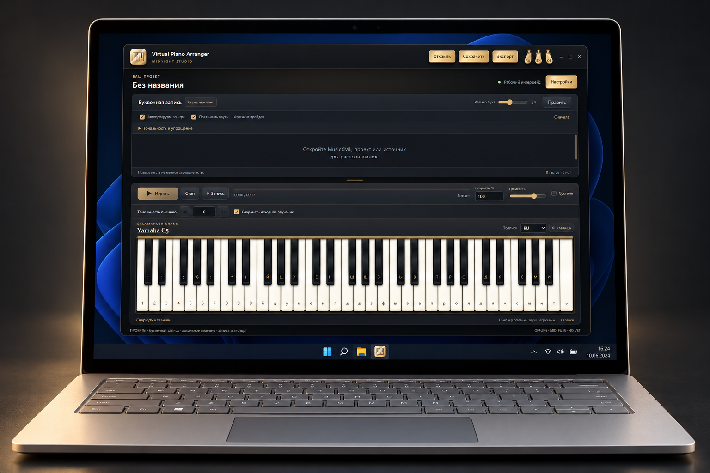

# Virtual Piano Arranger

[English](../README.md) · [Русский](README.ru.md) · [Deutsch](README.de.md)

Офлайн-пианино с буквенной записью, выбором партий MIDI и адаптацией нот для компьютерной клавиатуры из 61 клавиши.

Учебный некоммерческий демонстрационный проект: изучение музыкального ПО и показ его возможностей. Автор не продаёт приложение. Это описание цели проекта, а не ограничение прав, предоставленных MIT и лицензиями сторонних компонентов. Проект не заявляет о связи с авторами этих компонентов или об их одобрении.

Windows x64 · Русский / Deutsch / English · 0.1.0-preview.1

[Скачать portable для Windows](https://github.com/popovantondev/VirtualPianoArranger/releases/download/v0.1.0-preview.1/VirtualPianoArranger-0.1.0-preview.1-windows-x64-portable.zip) · [SHA-256](https://github.com/popovantondev/VirtualPianoArranger/releases/download/v0.1.0-preview.1/SHA256SUMS.txt) · [Соответствующие исходники](https://github.com/popovantondev/VirtualPianoArranger/releases/download/v0.1.0-preview.1/VirtualPianoArranger-0.1.0-preview.1-corresponding-sources.zip)

## Начало работы

Распакуйте всю папку portable и запустите `VirtualPianoArranger.exe`. EXE нельзя переносить отдельно от остальных файлов. Устанавливать Python или получать права администратора не требуется.

Откройте MIDI, прослушайте партии и выберите нужные. Также доступны MusicXML, проекты VPA и буквенный TXT. Распознавание PDF/изображений требует комплектного runtime и остаётся экспериментальным: сверяйте высоты и ритм с оригиналом.

**Тональность и упрощение** над буквами открывает предпросмотр. В режимах ПК, умеренного и музыкального упрощения полнота регулирует сопровождение из исходных нот. В режимах одной ноты сокращать аккорды уже нечего. Связь **Сохранять исходное звучание** сохраняет высоты источника; регистр букв может отличаться от звучания.

**Показывать паузы** есть над записью и в окне тональности. Знак ставится при настоящей тишине выбранных партий, не вместо пробелов и микрозазоров MIDI. TXT не содержит длительностей: паузы и автоматическое проигрывание не выдумываются.

[Русское руководство](https://popovantondev.github.io/VirtualPianoArranger/Guide-ru.html) · [English guide](https://popovantondev.github.io/VirtualPianoArranger/Guide-en.html) · [Deutsche Anleitung](https://popovantondev.github.io/VirtualPianoArranger/Guide-de.html)

## Ограничения

MIDI звучит пианино, а не исходными инструментами General MIDI. Для некоторых файлов требуется согласие на приблизительное проигрывание. Запись/WAV работают локально; другие форматы экспорта требуют отдельно доступного FFmpeg. Распознавание аудио/видео и импорт YouTube пока не доступны. Точность распознавания, другой ПК и длинные сеансы ещё требуют проверки. EXE без цифровой подписи.

Собственный код приложения распространяется по [MIT](../LICENSE). Сторонний код, сэмплы пианино и модели сохраняют свои лицензии: MIT их не заменяет.

Сохраняйте папку целиком, лицензии и уведомления. У выпуска есть отдельные исходники и SHA-256; прочитайте [уведомления](../DISTRIBUTION_NOTICES.md), [происхождение моделей](../MODEL_PROVENANCE.md) и [инструкцию замены библиотек](../LIBRARY_REPLACEMENT.md). Preview не означает, что проверены все партитуры или все компьютеры Windows.
